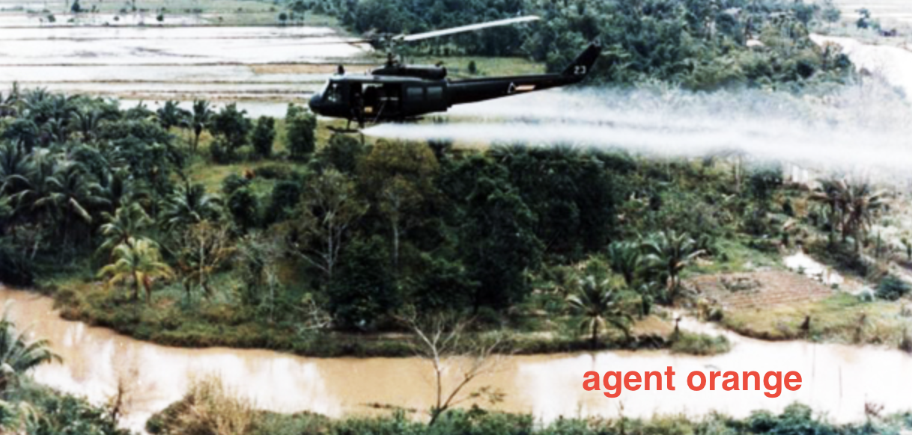
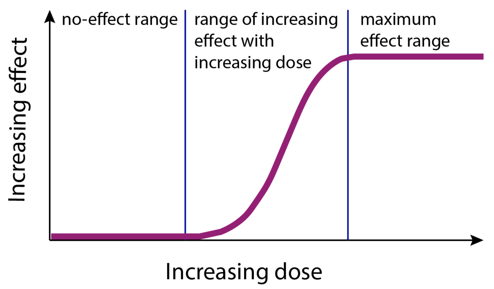
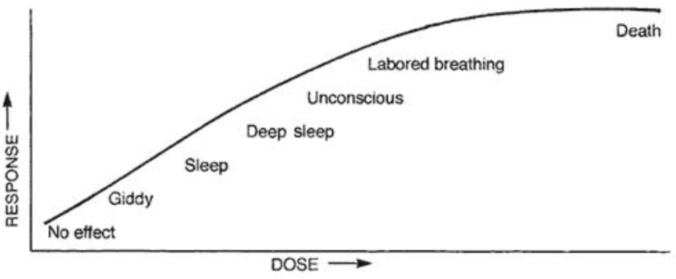
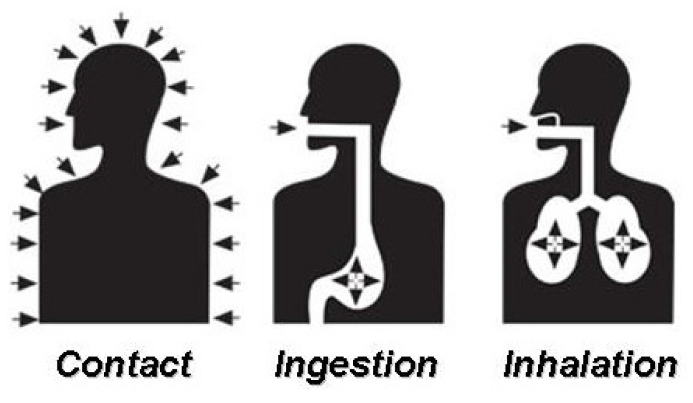
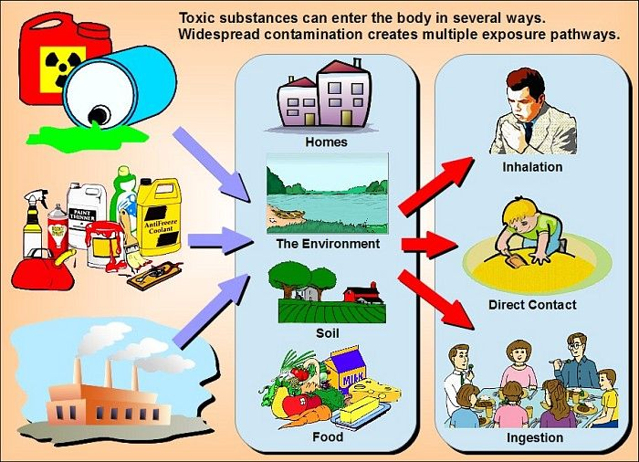
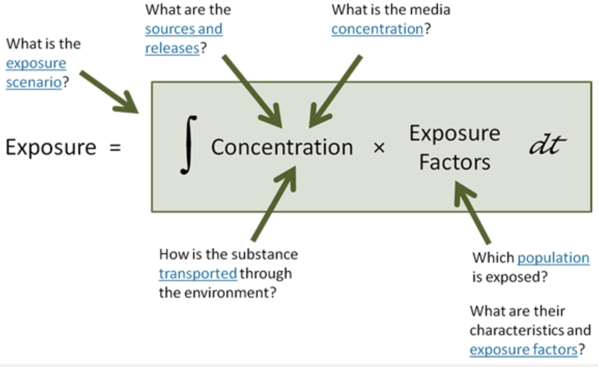

```{=html}
<style>
.circle {
  background-color: #FFCCCB; /* Light red background */
  border: 2px solid teal; /* Teal border */
  border-radius: 50%; /* Makes the circle round */
  color: teal; /* Teal text color */
  width: 75px; /* Circle diameter */
  height: 75px; /* Circle diameter */
  display: inline-block;
  text-align: center;
  line-height: 75px; /* Match the height to center the text vertically */
  vertical-align: middle; /* Aligns the circle vertically with adjacent text */
  margin-right: 5px;
}
</style>
```
```{=html}
<style>
.highlight-box {
  background-color: yellow;
  padding: 10px;
  border-radius: 5px;
}
</style>
```
```{=html}
<style>
ul {
  font-size: 85%;
}

ul ul {
  font-size: 75%;
}
</style>
```
{fig-align="center" width="327"}

# [**Chapter Overview**]{style="text-align: center; color: blue;"}

-   **Defining Risk**: Understanding risk as the probability of an event occurring, often implying harm.
-   **Concepts of Causation**: Reviewing causation from historical and contemporary perspectives.
-   **Quantifying Association**: Using ratio and difference measures to quantify associations.

# [**Chapter Overview**]{style="text-align: center; color: blue;"}

-   **Assessing Causal Effect**: Applying attributable risk and its variants.

-   **Competing Risks**: Explaining how competing risks affect mortality patterns.

-   **Risk Perception and Communication**: Recognizing the critical role of risk perception and communication in public health.

------------------------------------------------------------------------

## [1]{.circle}[**Risks in Population Health**]{style="color: teal;"}

-   **Central Task:** Assessing health risks [core function]{.highlight-box} in pop. health.
-   **Broad Usage of "[Risk]{.highlight-box}":** The term describes the [probability of adverse outcomes, risk factors, and health consequences]{style="color: fuchsia;"}.
-   **Risk Factors vs. Risk Markers:** Distinguishing between factors that [cause]{style="color: fuchsia;"} disease and those that [indicate]{style="color: fuchsia;"} its presence.
-   **Health Risk Appraisal (HRA):** Using quantitative procedures to estimate mortality and morbidity risks.
-   **Health Risk Assessment:** Evaluating scientific data on [hazardous environmental agents]{style="color: fuchsia;"} ⇔ [human exposure]{style="color: fuchsia;"}.

------------------------------------------------------------------------

## [2]{.circle}[**Health Risk Assessment Steps**]{style="color: teal;"}

1.  [**Hazard Identification**]{style="color: brown;"}**:** Identifying harmful agents and describing toxicity.
2.  [**Dose-Response Assessment**]{style="color: brown;"}**:** Modeling exposure and health effect size variations.
3.  [**Exposure Assessment**]{style="color: brown;"}**:** Identifying exposed populations, exposure routes, and dose characteristics.
4.  [**Risk Characterization**]{style="color: brown;"}**:** Integrating data to estimate harm likelihood.

------------------------------------------------------------------------

## [2]{.circle}[**Health Risk Assessment Steps**]{style="color: teal;"}

1.  [**Hazard Identification**]{style="color: brown;"}**:** Identifying [harmful agents]{style="color: brown;"} and describing toxicity

{fig-align="center" width="327"}

------------------------------------------------------------------------

## [2]{.circle}[**Health Risk Assessment Steps**]{style="color: teal;"}

-   **Flint resident lives in uncertainty after lead exposure** [youtube-link](https://www.youtube.com/watch?v=J1ypvScYz-Q)

-   **Japan Declares Crisis As Fukushima Reactor Begins Falling Into Ocean And Radiation Levels Soar** [youtube-link](https://www.youtube.com/watch?v=-j3Mu3Lcqpc)

------------------------------------------------------------------------

## [2]{.circle}[**Health Risk Assessment Steps**]{style="color: teal;"}

2.  [**Dose-Response Assessment**]{style="color: brown;"}**:** Modeling exposure and health effect size variations.

::: {style="display: flex; justify-content: center;"}
 
:::

------------------------------------------------------------------------

## [2]{.circle}[**Health Risk Assessment Steps**]{style="color: teal;"}

3.  [**Exposure Assessment**]{style="color: brown;"}**:** Identifying exposed populations, exposure routes, and dose characteristics.

::: {style="display: flex; justify-content: center;"}
 
:::

------------------------------------------------------------------------

## [2]{.circle}[**Health Risk Assessment Steps**]{style="color: teal;"}

3.  [**Exposure Assessment**]{style="color: brown;"}**:** Identifying exposed populations, exposure routes, and dose characteristics.

{fig-align="center" width="327"}

------------------------------------------------------------------------

## [2]{.circle}[**Health Risk Assessment Steps**]{style="color: teal;"}

4.  [**Risk Characterization**]{style="color: brown;"}**:** Integrating data to estimate harm likelihood.

{fig-align="center" width="327"}

------------------------------------------------------------------------

## [3]{.circle}[**Concepts of Causation**]{style="color: teal;"}

-   [**Necessary Cause**]{style="color: brown;"}**:** A cause that must be present for an effect to occur.
-   [**Sufficient Cause**]{style="color: brown;"}**:** A cause that inevitably produces the effect.
-   [**Remote vs. Proximate Causes**]{style="color: brown;"}**:** Understanding causal chains and effect proximity.

------------------------------------------------------------------------

## [3]{.circle}[**Concepts of Causation**]{style="color: teal;"}

-   [**Bradford Hill's**]{style="color: silver;"} **Criteria:**

    -   1 [**Strength & Consistency**]{style="color: gold;"} -- A strong and repeated association across studies increases the likelihood of causation.
    -   2 [**Specificity & Temporality**]{style="color: gold;"} -- The cause should lead to a specific effect, and the effect must occur **after** the cause.\
    -   3 [**Biological Gradient & Plausibility**]{style="color: gold;"} -- A dose-response relationship should exist, and the cause should make biological sense.\
    -   4 [**Coherence & Experiment**]{style="color: gold;"} -- The evidence should align with existing knowledge, and experiments should support the causal link.\
    -   5 [**Analogy** ]{style="color: gold;"}-- If similar factors cause similar effects, the association is more credible.

------------------------------------------------------------------------

## [4]{.circle}[**Measures of Association**]{style="color: teal;"}

-   **Ratio Measures:** Relative risk, risk ratio, rate ratio, odds ratio.
-   **Difference Measures:** Risk difference or attributable risk.
-   **Relative Risk (RR):** $RR = \frac{I_1}{I_0}$
-   **Odds Ratio (OR):** $OR = \frac{(a/c)}{(b/d)} = \frac{ad}{bc}$
-   **Risk Difference (RD):** $RD = I_1 - I_0$
-   **Attributable Risk Among the Exposed \[AR(E)\]:** $AR(E) = \frac{(I_1 - I_0)}{I_1} = \frac{(RR - 1)}{RR}$
-   **Population Attributable Risk (PAR):** $PAR = \frac{(I - I_0)}{I} = \frac{P(RR - 1)}{P(RR - 1) + 1}$

------------------------------------------------------------------------

## [5]{.circle}[**Competing Risks**]{style="color: teal;"}

-   **Definition:** Recognizes that individuals are exposed to multiple risks, where one event prevents another.
-   **Importance:** Essential for understanding mortality trends and disease impact.
-   **Statistical Approaches:** Methods to estimate death probability in competing risks.

------------------------------------------------------------------------

## [6]{.circle}[**Risk Perception and Communication**]{style="color: teal;"}

-   **Subjectivity of Risk:** Public perception differs from expert assessments.
-   **Social Construction of Risk:** Influences include social, cultural, and political factors.
-   **Factors Influencing Risk Acceptance:** Fair distribution, benefits, alternatives, voluntary vs. imposed risks, and control.
-   **Biases in Probability Assessment:** Representativeness, anchoring, and availability.
-   **Effective Risk Communication:** Public involvement, planning, listening, honesty, coordination, media engagement, clarity, and compassion.
